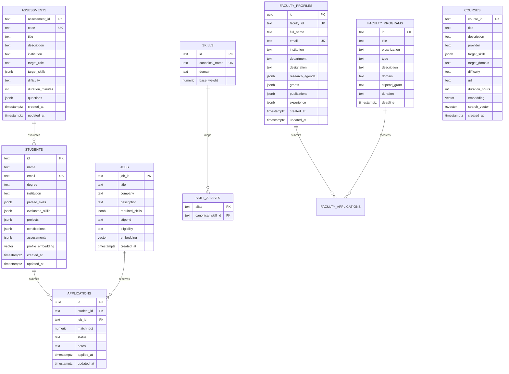

# SkillBridge — Architecture & Technical Specification

Platform: Academia-Industry Skill Mapping & Placement Platform (SIH26044).

---

## 1. System Architecture Diagrams

### 1.1 Domain Pipeline Topology

```mermaid
graph TD
    subgraph ClientTier ["1. Client & Ingestion"]
        SPA["Vue 3 ESM SPA (Composition API Bridges, Tailwind JIT, Chart.js)"]
        JIT["Bun.Transpiler (Zero-Disk In-Memory C++ AST Lowering & Dynamic ESM)"]
        SPA <--> JIT
    end

    subgraph GatewayTier ["2. Gateway & Resilience"]
        GW["Express 5 REST API Gateway (Stateless JWT RBAC, Helmet, RateLimiter, Zod)"]
        Terminus["Terminus Lifecycle (/health/live, /health/ready, Connection Drain)"]
        CB["Opossum Circuit Breakers (30s Timeout, 50% Threshold, Exponential Backoff)"]
        GW --- Terminus
        GW --- CB
    end

    ClientTier -->|HTTP REST & ESM| GW

    subgraph Subsystems ["3. Domain Subsystems"]
        direction LR

        subgraph CandidatePipe ["Candidate Ingestion & Calibration"]
            C1["pdf-parse Binary Buffer Extraction"]
            C2["Mistral Large Structured JSON Schema Extraction"]
            C3["Alias Trie & Levenshtein Normalizer (Sim >= 0.85)"]
            C4["Multi-Signal Competency Scoring: FinalScore = sum(w_i * S_i) / sum(w_active)"]
            C5["Cryptographic PDF Resume Compilation (pdf-lib)"]
            C1 --> C2 --> C3 --> C4 --> C5
        end

        subgraph FacultyPipe ["Faculty Research & Institutional Governance"]
            F1["Multi-Tenant Isolation (req.user.institution_or_company)"]
            F2["Research Portfolio: Lab Projects, Grants & Publications"]
            F3["One-Click Standardized Academic CV Compilation (pdf-lib)"]
            F4["Courseware Authoring: Local Syllabi & Consortium Federation (Swayam/NPTEL/MIT OCW)"]
            F5["Standardized Assessment Suite Authoring (IITD-COP, ANTHROPIC-AI)"]
            F6["Institutional Placement Telemetry & Competency Filtering (CUDA, Raft, LLVM)"]
            F1 --> F2 --> F3
            F1 --> F4 --> F5 --> F6
        end

        subgraph MatchPipe ["Semantic Retrieval & Explainable ATS"]
            M1["Requisition Vectorization (Ollama nomic-embed-text-v2-moe, 768-d)"]
            M2["Unit-Normalized Cosine Dot Product: sim(u, v) = sum(u_i * v_i) >= 0.88"]
            M3["Parallel Role Fit: MatchPct = floor(sum(min(1, depth_cand / depth_req)) / N * 100)"]
            M4["Domain-Weighted Deficit Remediation Course Dispatch"]
            M5["Explainable AI Traceability Matrix: Reliability = 1 - sigma"]
            M1 --> M2 --> M3 --> M4 --> M5
        end
    end

    CB --> Subsystems

    subgraph PersistenceTier ["4. Persistence & Inference Tier"]
        Ollama["Ollama (nomic-embed-text-v2-moe, 768-d Dense Vectors)"]
        Mistral["Mistral AI API (mistral-large JSON Mode)"]
        PG[("PostgreSQL 16 + pgvector (HNSW Index, vector_cosine_ops)<br/>GIN Trigram Indexes • Pre-Warmed Course Cache • pg-boss Queue")]
        Ollama --- PG
        Mistral --- PG
    end

    Subsystems --> PersistenceTier
```

---

### 1.2 Component Topology

```mermaid
graph TB
    subgraph ClientPresentation ["Presentation Tier"]
        VueApp["Vue 3 SPA (Composition API)"]
        Tailwind["Tailwind CSS (JIT)"]
        ChartJS["Chart.js"]
        Composables["Composables: useAuth, useJobs, useCourses, useAssessments"]
        VueApp --- Tailwind
        VueApp --- ChartJS
        VueApp --- Composables
    end

    subgraph GatewayRuntime ["Runtime & Gateway Tier"]
        Bun["Bun Runtime (Native TS Engine)"]
        JIT_Engine["Bun.Transpiler (On-The-Fly In-Memory Transpiler)"]
        SecMiddleware["Security: Helmet, CORS, RateLimiter, JWT"]
        TerminusLifecycle["Terminus (/health/live, /health/ready, Pool Drain)"]
        ExpressRouter["Express 5 REST Router (/api)"]
        Bun --> JIT_Engine
        Bun --> ExpressRouter
        ExpressRouter --> SecMiddleware
        ExpressRouter --> TerminusLifecycle
    end

    ClientPresentation -->|Module Fetch /js/*.js| JIT_Engine
    ClientPresentation -->|REST Requests| ExpressRouter

    subgraph CoreServices ["Domain Services Tier"]
        S_Profile["profile.service (Multi-Signal Scoring)"]
        S_Resume["resume.service & pdf-generator (Parse & CV Export)"]
        S_Match["matching.service (Cosine Dot Product)"]
        S_Course["course.service (Gap Analysis & Cache)"]
        S_Assess["assessment.service (Suites & Retakes)"]
        S_Faculty["faculty.service (Grants & Publications)"]
        S_Analytics["analytics.service (Isolation & Telemetry)"]
        S_Norm["skill-normalizer.service (Fuzzy Levenshtein)"]
    end

    ExpressRouter --> S_Profile
    ExpressRouter --> S_Resume
    ExpressRouter --> S_Match
    ExpressRouter --> S_Course
    ExpressRouter --> S_Assess
    ExpressRouter --> S_Faculty
    ExpressRouter --> S_Analytics
    S_Profile --> S_Norm
    S_Match --> S_Norm
    S_Course --> S_Norm

    subgraph CircuitBreakers ["Resilience Adapters"]
        CB_Ollama["Opossum Breaker (Ollama, 30s Timeout, 50% Threshold)"]
        CB_Mistral["Opossum Breaker (Mistral, 30s Timeout, Exponential Backoff)"]
        S_Profile --> CB_Mistral
        S_Resume --> CB_Mistral
        S_Profile --> CB_Ollama
        S_Match --> CB_Ollama
        S_Course --> CB_Ollama
    end

    subgraph InferenceAndStorage ["Inference & Storage Tier"]
        OllamaServer["Ollama (nomic-embed-text-v2-moe, 768-d)"]
        MistralAPI["Mistral AI API (mistral-large)"]
        PG_DB[("PostgreSQL 16 + pgvector (HNSW) + GIN Indexes")]
        CourseCache["In-Memory Cache (~2,150 Curricula)"]
        CB_Ollama --> OllamaServer
        CB_Mistral --> MistralAPI
        S_Profile --> PG_DB
        S_Resume --> PG_DB
        S_Match --> PG_DB
        S_Course --> CourseCache
        S_Course --> PG_DB
        S_Assess --> PG_DB
        S_Faculty --> PG_DB
        S_Analytics --> PG_DB
    end
```

---

## 2. Technology Stack

* **Runtime**: Bun 1.3+ / Node.js + TypeScript (Strict mode, zero `any`).
* **API Gateway**: Express 5.x REST Gateway.
* **Client Transpilation**: `Bun.Transpiler` in-memory JIT lowering (zero `public/js` disk writes).
* **Frontend**: Vue 3 (Composition API, native ESM), Tailwind CSS, Chart.js.
* **Relational Storage**: PostgreSQL 16.
* **Vector Engine**: `pgvector` (768-dimensional dense vectors, HNSW index, `vector_cosine_ops`).
* **Embeddings**: Local Ollama runtime (`nomic-embed-text-v2-moe`, 768 dimensions).
* **LLM Extraction**: Mistral AI API (`mistral-large`, JSON mode).
* **Fault Tolerance**: `opossum` circuit breakers (30s timeout, 50% trip threshold, 60s cooldown).
* **Lifecycle Management**: `@godaddy/terminus` (`/health/live`, `/health/ready`, connection draining).
* **Job Queue**: `pg-boss` transactional PostgreSQL background queues.
* **Document Engine**: `pdf-parse` (binary extraction), `pdf-lib` (cryptographic PDF generation).
* **Security**: Stateless JWT, bcryptjs, Helmet, express-rate-limit, Zod schemas.

---

## 3. Core Algorithms & Subsystem Specifications

### 3.1 Multi-Signal Competency Scoring (`profile.service.ts`)

* **Formula**:
  $$\text{FinalScore} = \frac{w_{\text{llm}} \cdot S_{\text{llm}} + w_{\text{vec}} \cdot S_{\text{vec}} + w_{\text{cert}} \cdot S_{\text{cert}} + w_{\text{assess}} \cdot S_{\text{assess}}}{\sum w_{\text{active}}}$$
* **Weights**:
  * $w_{\text{llm}} = 0.50$: LLM semantic rating from project achievements.
  * $w_{\text{vec}} = 0.50$: Cosine similarity against domain reference anchors.
  * $w_{\text{cert}} = 0.10$: Verified institutional certificate bonus.
  * $w_{\text{assess}} = 0.15$: Highest score achieved in institutional assessment suites.
* **Dynamic Active Denominator**: Normalizes over present signals; no penalty for unattempted assessments.
* **Proficiency Tiers**:
  * Novice: $< 0.40$
  * Intermediate: $0.40 \le \text{Score} < 0.75$
  * Advanced: $\ge 0.75$

---

### 3.2 Dense Vector Matching Engine (`matching.service.ts`)

* **Embedding Model**: Ollama `nomic-embed-text-v2-moe` (768 dimensions).
* **Unit-Vector Optimization**: Boot-time $L_2$-normalization converts cosine similarity to dot product:
  $$\text{sim}(\mathbf{u}, \mathbf{v}) = \sum_{i=1}^{768} u_i v_i$$
* **Matching Threshold**: $\text{sim} \ge 0.88$.
* **Role Match Score**:
  $$\text{MatchPct} = \left\lfloor \frac{\sum \min\left(1.0, \frac{\text{depth}_{\text{cand}}}{\text{depth}_{\text{req}}}\right)}{\text{total required skills}} \times 100 \right\rfloor$$
* **Execution**: Parallel asynchronous evaluation via `Promise.all`.

---

### 3.3 Skill Normalization & Taxonomy Cache (`skill-normalizer.service.ts`)

* **Lookup Cache**: In-memory hash map for $O(1)$ canonical alias resolution.
* **Token Preservation**: Retains symbols in programming tokens (`C++`, `C#`, `.NET`).
* **Fuzzy Matcher**: Levenshtein distance ratio with threshold $\ge 0.85$.
* **Passthrough**: Novel terms assigned base confidence score $0.30$.

---

### 3.4 Curriculum Gap Remediation Engine (`course.service.ts`)

* **Curriculum Aggregator**: Combines institutional courses with national/global catalogs (Swayam, NPTEL, Skill India, MIT OCW).
* **Cache**: Boot pre-warming of ~2,150 curricula (TTL: 1 hour) with domain-weighted keyword scoring.
* **Scoping**: Faculty members maintain write access to affiliated university courses; consortium catalog operates in read-only mode.

---

### 3.5 Explainable AI (XAI) Traceability Matrix (`TraceabilityMatrix.ts`, `traceability.ts`)

* **Signal Attribution**: Line-by-line project evidence attribution from source resumes.
* **Semantic Anchor Delta**: Quantified vector distance to domain benchmarks.
* **Assessment Verification**: Direct link to quiz question score breakdowns.
* **Reliability Metric**:
  $$\text{Reliability} = 1 - \sigma, \quad \sigma = \sqrt{\frac{1}{N}\sum(x_i - \mu)^2}$$

---

### 3.6 Faculty Research Portfolio & Governance (`faculty.service.ts`, `FacultyProfileView.ts`)

* **Multi-Tenant Scoping**: Cryptographically enforced via `req.user.institution_or_company`.
* **Research Infrastructure**: Lab project tracking, sponsored grants (DST, SERB, MeitY, CSIR), and peer-reviewed bibliographies.
* **CV Generator**: Dynamic cryptographic PDF compilation via `pdf-lib` with institutional affiliations and grant registries.
* **Assessment Engineering**: Authoring of standardized institutional test suites (`IITD-COP-701`, `ANTHROPIC-AI-501`).
* **Placement Telemetry**: Cohort filtering by verified competencies (CUDA, Raft, LLVM) and recruitment funnel transition monitoring.

---

## 4. Database Schema

PostgreSQL 16 with `pgvector` and `pg_trgm`.

* **Vector Indexes**: HNSW on `courses.embedding`, `jobs.embedding`, and `students.profile_embedding` (`vector_cosine_ops`).
* **Text Indexes**: GIN on `courses.search_vector`.
* **B-Tree Indexes**: `applications(student_id, job_id)`, `assessments(code)`, `skills(canonical_name)`, `students(email)`, `faculty_profiles(email)`.

---

## 5. API Route Directory

### 5.1 Health
* `GET /health/live`: Liveness probe (HTTP 200, process uptime).
* `GET /health/ready`: Readiness probe (PostgreSQL pool & Ollama latency).

### 5.2 Authentication
* `POST /api/auth/login`: Authenticate credentials, issue JWT role claims.
* `POST /api/auth/register`: User registration.
* `GET /api/auth/me`: Validate token and return user identity claims.

### 5.3 Candidate Profiles
* `POST /api/students/upload-resume`: Ingest PDF resume, execute LLM extraction, calibrate skills.
* `GET /api/students/:id/profile`: Return candidate profile and competency ratings.
* `GET /api/students/:id/public`: Public profile endpoint for portfolio sharing.
* `GET /api/students/:id/resume`: Dynamic PDF resume compilation via `pdf-lib`.
* `POST /api/students/:id/projects`: Add project portfolio record.
* `PUT /api/students/:id/projects/:idx`: Update project portfolio record.
* `DELETE /api/students/:id/projects/:idx`: Remove project portfolio record.

### 5.4 Standardized Assessments
* `GET /api/assessments`: List assessment suites with question banks.
* `GET /api/assessments/:idOrCode`: Fetch assessment suite by ID/Code.
* `POST /api/assessments/submit`: Evaluate submission, update skills, issue certificate.
* `POST /api/assessments/create`: Author and publish assessment suite.
* `PUT /api/assessments/:id`: Update assessment suite.

### 5.5 Requisitions & Matching
* `GET /api/jobs`: List active requisitions.
* `GET /api/jobs/matches/:studentId`: Return positions ranked by match score with remedial courses.
* `POST /api/jobs/create`: Create requisition and generate 768-d embedding.
* `GET /api/applications`: Recruiter ATS application list.
* `PUT /api/applications/:id/status`: Update applicant status.
* `POST /api/applications/apply`: Submit job application.
* `GET /api/applications/student/:id`: Return student applications.

### 5.6 Faculty & Analytics
* `GET /api/faculty/profile`: Fetch faculty profile (agenda, grants, publications).
* `PUT /api/faculty/profile`: Update faculty profile data.
* `GET /api/faculty/profile/cv`: Dynamic academic CV PDF export via `pdf-lib`.
* `GET /api/faculty/programs`: List FDPs and sabbatical programs.
* `POST /api/faculty/apply`: Submit sabbatical/grant application.
* `GET /api/analytics/institution`: Institution-isolated placement telemetry and candidate directory.

### 5.7 Courseware
* `GET /api/courses`: Paginated search across institutional and consortium courses.
* `POST /api/courses/create`: Author institutional course.
* `PUT /api/courses/:id`: Update institutional course.
* `GET /api/courses/recommended/:id`: Identify skill deficits and return remedial courses.
