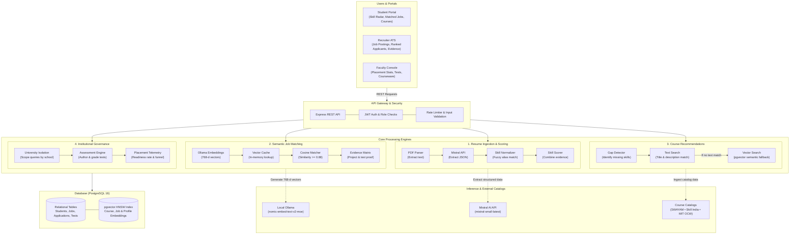
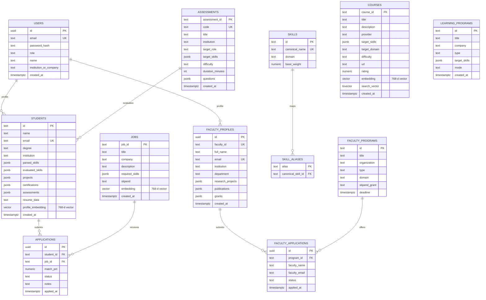

# SkillBridge: System Architecture

Platform: Academia-Industry Skill Mapping & Placement Platform (SIH26044)

---

## 1. Overview

SkillBridge matches students with job requisitions based on verified technical ability rather than resume buzzwords. It evaluates practical project experience, validates skills through test suites, measures role fit through semantic vector search, and suggests specific courses to close any skill gaps.

The system serves three user groups:
* **Students**: Upload resumes, calibrate skill ratings, take assessments, view matched jobs, and follow course recommendations for missing skills.
* **Recruiters**: Post job openings with required skill depths, view applicants ranked by semantic fit, and inspect evidence for every claimed skill.
* **Faculty & Placement Cells**: Monitor cohort placement readiness, author institutional test suites and courses, and view student progress restricted to their university.

---

## 2. System Architecture

---

## 3. How the Core Engines Work

### 3.1 Resume Ingestion & Skill Scoring

Students upload their resume as a PDF. The platform extracts and scores their skills through four steps:

1. **Text Extraction**: The server checks file size (under 5 MB) and verifies PDF header bytes, then reads raw text using `pdf-parse`.
2. **Data Extraction**: `mistral-small-latest` converts the text into structured JSON containing projects, tools used, certifications, and candidate details.
3. **Skill Normalization**: Raw skill names pass through an in-memory dictionary to resolve aliases (for example, mapping "Node", "NodeJS", and "node.js" to a single name). Unrecognized terms use Levenshtein distance matching with an 85% similarity threshold, preserving programming tokens like `C++`, `C#`, and `.NET`.
4. **Multi-Signal Skill Scoring**: Self-reported resume bullet points are not accepted at face value. The final skill score blends four separate signals:
   * **Project Depth (50% weight)**: The level of complexity demonstrated in projects using that tool.
   * **Vector Benchmark (50% weight)**: Cosine similarity between candidate project descriptions and reference benchmarks (novice vs. production-level project descriptions).
   * **Certifications (10% bonus)**: Added when the candidate holds a verified credential in that topic.
   * **Test Scores (15% weight)**: Added when the student passes an assessment suite covering that skill.

To avoid penalizing students who haven't taken a test yet, the formula divides only by the weights of signals that actually exist. If a student has not taken a test, that weight is left out of the denominator.

Scores fall into three tiers:
* **Novice**: Below 40%
* **Intermediate**: 40% to 74%
* **Advanced**: 75% and above

---

### 3.2 Semantic Job Matching

Recruiters publish jobs with required skills and desired minimum depth levels (for example: `Distributed Systems` at depth 0.80).

1. **Pre-Warmed Vector Cache**: When the server starts, it vectorizes all active job requirements and student skills into memory using Ollama (`nomic-embed-text-v2-moe`, 768 dimensions). This keeps candidate matching under 20 milliseconds per job.
2. **Matching Strategy**:
   * Exact Match: Direct string match or substring match counts as 100% similarity.
   * Semantic Vector Match: In-memory cosine dot-product between skill vectors. Skills with similarity 0.88 or higher count as matched.
3. **Role Fit Calculation**: For every required skill, the engine measures the candidate's depth against the job's target depth, capped at 1.0. The overall match percentage is the average of these ratios across all required skills. Candidates scoring 70% or higher are marked as qualified.

---

### 3.3 Applicant Evidence Breakdown

Recruiters evaluate candidate rankings through an evidence table that backs up every score:
* **Ingestion Proof**: The specific project title where the skill was used, the line range in the resume text, and matched technical keywords.
* **Semantic Distance**: Vector similarity score to domain reference benchmarks.
* **Test Verification**: The test code, specific question topic, and verified percentage score. If the student has not taken a test for that skill, the column clearly reads "Not Attempted" without fake placeholder scores.
* **Signal Reliability**: Measures agreement between the student's project depth and test scores. Close scores across both project work and tests produce a "High Reliability" label. Large discrepancies flag the rating for human review.

---

### 3.4 Closing Skill Gaps with Courses

When a student checks their match against a job, any required skill where they fall short triggers course recommendations:

1. **Gap Detection**: Identifies skills required by the job where the student either has no experience or scores below the required depth.
2. **Two-Stage Search**:
   * Stage 1: Fast SQL text search (`ILIKE`) across indexed course titles and descriptions.
   * Stage 2: If text search finds no matches, runs vector similarity search against 768-dimensional course embeddings in `pgvector`.
3. **Catalog Sources**: Courses are ingested and indexed from three catalogs:
   * **SWAYAM / NPTEL**: Indian national university curricula with academic instructor attribution.
   * **Skill India Digital Hub (SIDH / NSDC)**: Government vocational and technical skill credentials.
   * **MIT OpenCourseWare**: Foundational computer science and engineering modules.

---

### 3.5 Institutional Governance & Placement Tracking

University faculty and placement officers manage their students with privacy enforced at the database level:

* **University Isolation**: SQL queries filter data by the user's institution. Faculty members can only view student profiles, test results, and analytics from their own university.
* **Placement Readiness Rate**: Percentage of the student cohort with an average evaluated skill depth of 65% or higher.
* **Hiring Funnel**: Real-time pipeline showing how many students have applied, are under review, shortlisted, or selected.
* **Curriculum Alignment**: Highlights high-demand skills from current job postings where the student cohort has low average depth, showing departments where course updates are needed.
* **Faculty CV Export**: Generates standardized academic CV PDFs via `pdf-lib` detailing research grants (DST, SERB, MeitY), publications, and industry consulting.

---

## 4. Database Design & Indexing

PostgreSQL 16 with `pgvector` and `pg_trgm`.

### Indexing Strategy
* **Vector Index (HNSW)**: Approximate nearest neighbor index with cosine distance (`vector_cosine_ops`) on `courses.embedding`, `jobs.embedding`, and `students.profile_embedding`. Queries run in under 10 milliseconds over 768-dimensional spaces.
* **Full-Text Search Index (GIN)**: Indexed on `courses.search_vector` for keyword searches across course titles and descriptions. Trigram indexes on `courses.title` handle fuzzy course lookups.
* **Relational B-Tree Indexes**: Indexed on `applications(student_id, job_id)`, `students(email)`, `assessments(code)`, `users(email)`, and `skills(canonical_name)`.

---

## 5. Resilience & Fault Tolerance

* **Circuit Breakers (`opossum`)**:
  * Ollama Embedding Breaker: 60-second timeout with a 50% error trip threshold. If the Ollama server is offline or slow, the fallback returns zero-vectors so search falls back gracefully to text matching without crashing.
  * Mistral LLM Breaker: 90-second timeout with exponential backoff retries. If the Mistral API is unreachable, a basic parsed profile structure is produced to avoid blocking user workflows.
* **Health Probes (`@godaddy/terminus`)**:
  * `/health/live`: Fast heartbeat returning process uptime and status 200.
  * `/health/ready`: Checks PostgreSQL connection pool health and measures Ollama round-trip latency. Returns status 503 if the database is unreachable.
  * `/health`: Overall status endpoint reporting circuit breaker metrics, database health, and server uptime.
* **Graceful Shutdown**: Intercepts `SIGTERM` and `SIGINT` signals, drains in-flight HTTP connections within a 5-second window, and closes database connections cleanly.
