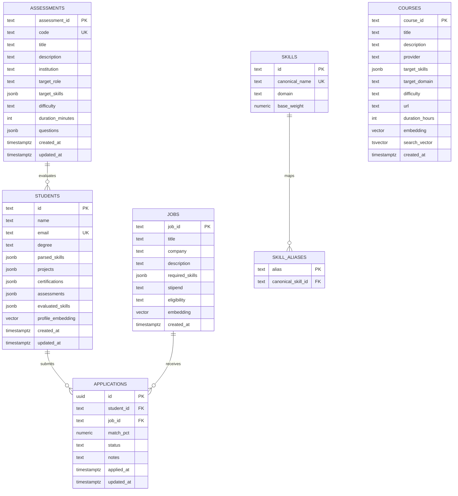

# SkillBridge — Architecture

---

## Stack

| Layer | Technology |
| :--- | :--- |
| Runtime | Node.js / Bun + TypeScript |
| API | Express |
| Database | PostgreSQL + `pgvector` (768-dim) |
| Resume Parsing | Mistral AI (structured JSON extraction) |
| Embeddings | Ollama `nomic-embed-text-v2-moe` |
| PDF Generation | `pdf-lib` |
| Auth | JWT (role claims: `student`, `recruiter`, `faculty`) |

---

## Architecture

```
Client (Vue SPA)
     │
     ▼
Express API Gateway (/api)
     │
     ├─ profile.service ──► Mistral AI, Ollama
     ├─ matching.service ──► Ollama + pgvector
     ├─ assessment.service ──► Postgres
     ├─ course.service ──► Postgres + pgvector
     ├─ application.service ──► Postgres
     └─ skill-normalizer.service ──► Postgres (alias cache)
     │
     ▼
PostgreSQL + pgvector
```

---

## Key Subsystems

### Competency Scoring (`profile.service.ts`)

Computes a normalized depth score $S \in [0,1]$ per skill from four independent signals:

$$\text{Score} = \frac{w_\text{llm} \cdot S_\text{llm} + w_\text{vec} \cdot S_\text{vec} + w_\text{cert} \cdot S_\text{cert} + w_\text{assess} \cdot S_\text{assess}}{\sum w_\text{active}}$$

| Signal | Weight | Source |
| :--- | :--- | :--- |
| LLM rating | 0.50 | Mistral extraction from project descriptions |
| Vector similarity | 0.50 | Cosine distance to domain anchor embeddings |
| Certification bonus | 0.10 | Verified credential match |
| Assessment score | 0.15 | Best institutional quiz score |

Denominator normalizes only over active signals (no penalty for unattempted assessments/certs).

Tiers: `Novice` < 0.40, `Intermediate` 0.40–0.75, `Advanced` ≥ 0.75.

---

### Vector Matching (`matching.service.ts`)

- Vectors are $L_2$-normalized at boot → cosine similarity becomes a dot product.
- Role matches run in parallel via `Promise.all`.
- Skill match threshold: similarity ≥ 0.88.

$$\text{MatchPct} = \left\lfloor \frac{\sum \min\!\left(1, \frac{\text{candidate depth}}{\text{required depth}}\right)}{\text{total required skills}} \times 100 \right\rfloor$$

---

### Skill Normalization (`skill-normalizer.service.ts`)

On startup: loads all `skill_aliases` into a `Map<string, string>` for O(1) lookups. Handles:
- Exact alias match → canonical name
- Levenshtein fuzzy match (threshold ≥ 0.85)
- Preserves tokens like `C++`, `C#`, `.NET`
- Unknown skills fall through with confidence 0.30

---

### Remedial Course Recommendations (`course.service.ts`)

Identifies skill gaps from unmatched job requirements, then selects courses by:
1. Domain-weighted keyword scoring (`CUDA` → 6.172, `PyTorch` → 6.s191, etc.)
2. Course skill list exact/partial match
3. Penalizes non-CS/non-systems courses for engineering roles
4. Deduplicates by course number prefix

Course cache: all courses loaded at boot into in-memory array (~2,150 MIT OCW entries). Cache TTL: 1 hour.

---

## Database Schema

```
STUDENTS
  id (PK), name, email (UK), degree
  parsed_skills (jsonb), evaluated_skills (jsonb)
  projects (jsonb), certifications (jsonb), assessments (jsonb)
  profile_embedding (vector 768)

JOBS
  job_id (PK), title, company, description
  required_skills (jsonb), stipend, eligibility
  embedding (vector 768)

APPLICATIONS
  id (uuid PK), student_id (FK), job_id (FK)
  match_pct, status, notes, applied_at, updated_at

ASSESSMENTS
  assessment_id (PK), code (UK), title, institution
  target_role, target_skills (jsonb), difficulty
  duration_minutes, questions (jsonb)

COURSES
  course_id (PK), title, description, provider
  target_skills (jsonb), target_domain, difficulty
  url, duration_hours, embedding (vector 768)

SKILLS / SKILL_ALIASES
  Canonical taxonomy + alias resolution table
```

**Indexes**: HNSW on `courses.embedding`, `jobs.embedding`, `students.profile_embedding` (cosine). GIN on `courses.search_vector`. B-tree on `applications(student_id, job_id)`, `students(email)`.

**RPC Functions**: `match_courses(embedding, threshold, count)`, `hybrid_search_courses(text, embedding, count, vec_weight, text_weight)`.

---

## API Reference

### Auth
| Method | Route | Notes |
| :--- | :--- | :--- |
| `POST` | `/api/auth/login` | Returns JWT with role claim |
| `POST` | `/api/auth/register` | student / recruiter / faculty |
| `GET` | `/api/auth/me` | Token validation |

### Students
| Method | Route | Notes |
| :--- | :--- | :--- |
| `POST` | `/api/students/upload-resume` | PDF → parse → score → save |
| `GET` | `/api/students/:id/profile` | Skills, projects, radar metrics |
| `GET` | `/api/students/:id/resume` | Download generated PDF |
| `POST/PUT/DELETE` | `/api/students/:id/projects/:idx` | CRUD project entries |
| `DELETE` | `/api/students/:id/skills/:name` | Remove skill, re-score |

### Jobs & Matching
| Method | Route | Notes |
| :--- | :--- | :--- |
| `GET` | `/api/jobs` | All open requisitions |
| `GET` | `/api/jobs/matches/:studentId` | Ranked matches + remedial courses |
| `POST` | `/api/jobs/create` | Create requisition + embed |

### Applications
| Method | Route | Notes |
| :--- | :--- | :--- |
| `GET` | `/api/applications` | All applications (recruiter) |
| `POST` | `/api/applications/apply` | Submit application |
| `PATCH` | `/api/applications/:id/status` | `Applied → Shortlisted → Selected` etc. |
| `GET` | `/api/applications/student/:id` | Student's own applications |

### Assessments
| Method | Route | Notes |
| :--- | :--- | :--- |
| `GET` | `/api/assessments` | All suites, filterable by institution/difficulty |
| `POST` | `/api/assessments/submit` | Grade quiz, issue cert, update profile |
| `POST/PUT` | `/api/assessments/create`, `/:id` | Faculty authoring |

### Courses
| Method | Route | Notes |
| :--- | :--- | :--- |
| `GET` | `/api/courses` | Paginated, supports `q`, `difficulty` |
| `POST` | `/api/courses/create` | Add course |

### Analytics
| Method | Route | Notes |
| :--- | :--- | :--- |
| `GET` | `/api/analytics/institution` | Placements, skill breakdown, totals |

---

## Resilience

| Concern | Approach |
| :--- | :--- |
| Mistral / Ollama failures | `opossum` circuit breaker — 30s timeout, 50% error threshold, 60s reset. Returns empty schema on open. |
| Transient errors | 3 retries with exponential backoff (1s / 2s / 4s) |
| Graceful shutdown | `@godaddy/terminus` — drains requests, closes DB pool on `SIGINT` |
| Health | `GET /health/live` (200 always), `GET /health/ready` (checks DB + Ollama latency) |
| Rate limiting | 100 req/min per IP (`express-rate-limit`) |

```mermaid
graph TD
  Client([Client / Single Page Application]) --> Router["Express API Gateway (/api)"]

  subgraph Services [Domain Services]
    S_Profile["Profile & Resume (resume.service, profile.service, pdf-generator.service)"]
    S_Match["Matching & Courses (matching.service, course.service)"]
    S_Assess["Assessments & Evaluation (assessment.service)"]
    S_Collab["Recruiter Pipeline & ATS (application.service, faculty.service, analytics.service)"]
    S_Normalizer["Skill Taxonomy & Normalization (skill-normalizer.service)"]
  end

  Router --> S_Profile
  Router --> S_Match
  Router --> S_Assess
  Router --> S_Collab

  S_Profile --> S_Normalizer
  S_Match --> S_Normalizer

  subgraph Adapters [External Engine Adapters]
    A_Mistral["Mistral AI (Structured JSON Extraction)"]
    A_Ollama["Ollama Engine (768-d nomic-embed-text-v2-moe)"]
  end

  S_Profile --> A_Mistral
  S_Profile --> A_Ollama
  S_Match --> A_Ollama
  S_Assess --> S_Profile

  DB[(PostgreSQL + pgvector)]

  S_Profile --> DB
  S_Match --> DB
  S_Assess --> DB
  S_Collab --> DB
```




---

## 2. Core Components & Subsystems

### 2.1 Multi-Signal Competency Scoring (`profile.service.ts`)

Computes a normalized skill depth rating $S \in [0, 1]$ per domain skill by combining independent empirical signals:

$$\text{FinalScore} = \frac{w_{\text{llm}} \cdot S_{\text{llm}} + w_{\text{vec}} \cdot S_{\text{vec}} + w_{\text{cert}} \cdot S_{\text{cert}} + w_{\text{assess}} \cdot S_{\text{assess}}}{\sum w_{\text{active}}}$$

* **Signal Weights**:
  * $w_{\text{llm}} = 0.50$: Structured extraction rating from candidate project descriptions.
  * $w_{\text{vec}} = 0.50$: Semantic cosine similarity between project portfolio embeddings and domain anchors ($0.15$ baseline fallback).
  * $w_{\text{cert}} = 0.10$: Credential verification bonus ($1.0$ for matching verified certificates).
  * $w_{\text{assess}} = 0.15$: Highest score achieved in institutional assessment suites for the skill.
* **Dynamic Denominator**: $\sum w_{\text{active}}$ normalizes strictly over active evidence signals, preventing negative penalties when optional certifications or assessments are not yet attempted.
* **Proficiency Tiers**:
  * `Novice`: $\text{Score} < 0.40$
  * `Intermediate`: $0.40 \le \text{Score} < 0.75$
  * `Advanced`: $\text{Score} \ge 0.75$

---

### 2.2 Skill Normalization & Taxonomy Cache (`skill-normalizer.service.ts`)

Resolves arbitrary strings extracted from resumes or job postings to canonical skill taxonomy records:

1. **In-Memory Alias Map**: Preloads `skill_aliases` on startup into an in-memory hash index for $O(1)$ lookup.
2. **Canonical Skill Registry**: Matches against canonical entries in the `skills` table.
3. **Punctuation & Token Preservation**: Preserves symbols in tokens such as `C++`, `C#`, and `.js` frameworks instead of stripping non-alphanumerics.
4. **Levenshtein String Distance**: Evaluates typo similarity ratio; matches if normalized similarity $\ge 0.85$.
5. **Passthrough Fallback**: Generates a runtime passthrough entry with confidence $0.30$ for emerging technologies.

---

### 2.3 Vector Matching Engine & Prewarmed Index (`matching.service.ts`, `embedding.service.ts`)

Evaluates role fit between candidate competencies and job requisitions:

* **Embedding Model**: Ollama running `nomic-embed-text-v2-moe` (768 dimensions).
* **Prewarming & Unit-Vector Normalization**: Prewarms and normalizes skill vectors on application boot. Because vectors are $L_2$-normalized, cosine similarity reduces to a fast dot product:
  $$\text{sim}(\mathbf{u}, \mathbf{v}) = \mathbf{u} \cdot \mathbf{v} = \sum_{i=1}^{768} u_i v_i$$
* **Parallel Role Evaluation**: Utilizes `Promise.all` across candidate positions to compute semantic matches concurrently.
* **Thresholding & Scoring**: Skills with $\text{sim} \ge 0.88$ are treated as semantic matches. For each matched skill, the ratio $\min(1.0, \frac{\text{candidate\_depth}}{\text{required\_depth}})$ is accumulated:
  $$\text{MatchPct} = \text{round}\left(\frac{\sum \text{ratio}}{\text{total\_required\_skills}} \times 100\right)$$

---

### 2.4 Resume Extraction & Verified PDF Generation (`resume.service.ts`, `pdf-generator.service.ts`)

* **Structured Parsing**: Extracts candidate metadata, education, verified skills, and project timeline ranges using Mistral AI with strict JSON schema validation.
* **Timeline Support**: Parses and formats `start_date` and `end_date` in `YYYY-MM` format, supporting ongoing/current initiatives (`YYYY-MM – Present`).
* **Verified PDF Resume Export**: Built on `pdf-lib`, generates downloadable PDF resumes with:
  * Multi-signal competency radar summaries.
  * Right-aligned project timeline metadata.
  * Verified institutional certification credentials and credential IDs.

---

### 2.5 Role-Based Assessment Suites & Retake Engine (`assessment.service.ts`)

Standardized multi-question evaluations curated by leading institutions across Novice, Intermediate, and Advanced tiers:

* **Catalog of Assessment Suites**:
  * **Anthropic Research**: *Frontier Alignment, Constitutional AI & Scalable Evaluation* (`ANTHROPIC-AI-501`, Advanced) & *Applied LLM Tool-Calling & Agents* (`ANTHROPIC-AI-201`, Beginner).
  * **Adobe Systems**: *High-Performance Creative Graphics & WebGL* (`ADOBE-SYS-301`, Intermediate) & *Computational Geometry & Document Engines* (`ADOBE-IMG-401`, Advanced).
  * **MIT EECS**: *Distributed Systems & Cloud Infrastructure Core Competency* (`MIT-EECS-6033`, Intermediate).
  * **Stanford CS**: *Full Stack TypeScript & Modern Reactive Architecture* (`STAN-CS-142`, Intermediate).
  * **IIT Delhi CSE**: *Linux Systems Programming, Kernel Internals & glibc* (`IITD-COP-701`, Advanced).
  * **BITS Pilani AI**: *Generative AI, Transformer Architecture & LLM Inference* (`BITS-AI-401`, Advanced).
* **Prioritization & Retakes**: Unattempted assessments are automatically promoted to the top of the feed. Completed suites display historical score badges (`Score: X% (Passed)`) and provide a **`🔄 Retake Assessment`** option that recalculates competency calibrations and awards updated certificates upon submission.

---

### 2.6 Recruiter Candidates Pipeline & ATS (`application.service.ts`)

* **Position Filtering**: Requisition selector allows recruiters to filter applicants by specific job opening with live applicant counters.
* **Multi-Mode Pipeline Sorting**:
  * *By Posting (Role Title)*: Alphabetical grouping by job title.
  * *Highest Match Score*: Descending match percentage ($100\% \to 0\%$).
  * *Candidate Name (A-Z)*: Alphabetical candidate sort.
  * *Application Status*: Ordered by pipeline phase (`Selected` $\to$ `Shortlisted` $\to$ `Under Review` $\to$ `Applied` $\to$ `Rejected`).
* **Status Transitions**: Synchronizes candidate pipeline stages directly with PostgreSQL.

---

## 3. Resilience and External Integrations

| Feature | Implementation | Notes |
| :--- | :--- | :--- |
| **Circuit Breakers** | `opossum` | Wrapped around Mistral and Ollama calls (30s timeout, 50% error threshold, 60s reset). Fallbacks return zero vectors or empty schema defaults. |
| **Retries** | Exponential backoff | 3 retry attempts with delays of 1s, 2s, 4s before throwing an error. |
| **Graceful Shutdown** | `@godaddy/terminus` | Listens to `SIGINT`, cleans up PostgreSQL connection pool, and drains ongoing requests. |
| **Health Checks** | `/health/live`, `/health/ready` | `/health/live` returns HTTP 200. `/health/ready` checks PostgreSQL connection and Ollama response latency. |

---

## 4. Database Schema

The platform runs on PostgreSQL with `vector` (`pgvector`) and `pg_trgm` extensions enabled.



### Key Indexes & Functions
* **Vector Indexes**: HNSW indexes on `courses.embedding`, `jobs.embedding`, and `students.profile_embedding` using `vector_cosine_ops`.
* **Full-Text Index**: GIN index on `courses.search_vector`.
* **Lookup Indexes**: B-tree indexes on `applications(student_id)`, `applications(job_id)`, `assessments(code)`, `skills(canonical_name)`, and `students(email)`.
* **RPC Functions**:
  * `match_courses(query_embedding, match_threshold, match_count)`: Finds courses by cosine distance.
  * `hybrid_search_courses(query_text, query_embedding, match_count, vector_weight, text_weight)`: Ranks courses by combining dense cosine similarity and full-text keyword rank.

---

## 5. API Reference

### Health
| Method | Route | Description |
| :--- | :--- | :--- |
| `GET` | `/health/live` | Liveness check (returns HTTP 200). |
| `GET` | `/health/ready` | Readiness check (validates PostgreSQL and Ollama connectivity). |

### Authentication
| Method | Route | Description |
| :--- | :--- | :--- |
| `POST` | `/api/auth/login` | Authenticates email & password; returns JWT with role claims (`student`, `faculty`, `recruiter`). |
| `POST` | `/api/auth/register` | Registers new student, recruiter, or faculty user account. |
| `GET` | `/api/auth/me` | Validates JWT token and returns authenticated user metadata. |

### Students & Profiles
| Method | Route | Description |
| :--- | :--- | :--- |
| `POST` | `/api/students/upload-resume` | Uploads PDF resume (`multipart/form-data`), parses timeline, scores skills, and updates profile. |
| `GET` | `/api/students/:id/profile` | Retrieves student profile, project timeline records, and multi-signal radar metrics. |
| `GET` | `/api/students/:id/resume` | Generates and downloads cryptographically verified PDF resume. |
| `POST` | `/api/students/:id/projects` | Adds a new project portfolio item with start/end month-year timeline. |
| `PUT` | `/api/students/:id/projects/:index` | Modifies an existing project portfolio entry. |
| `DELETE` | `/api/students/:id/projects/:index` | Deletes a project entry and recalculates portfolio embeddings. |
| `DELETE` | `/api/students/:id/skills/:skillName` | Removes a skill from candidate profile. |

### Role Assessments
| Method | Route | Description |
| :--- | :--- | :--- |
| `GET` | `/api/assessments` | Retrieves all assessment suites with question banks (filterable by `q`, `institution`, `role`, `difficulty`). |
| `GET` | `/api/assessments/:idOrCode` | Fetches a specific assessment suite by ID or Code. |
| `POST` | `/api/assessments/create` | Faculty endpoint to author and publish a new assessment suite. |
| `PUT` | `/api/assessments/:id` | Faculty endpoint to update an existing assessment suite. |
| `POST` | `/api/assessments/submit` | Grades candidate quiz submission, returns question breakdown, and updates student record. |

### Jobs & Recruiter Pipeline
| Method | Route | Description |
| :--- | :--- | :--- |
| `GET` | `/api/jobs` | Retrieves active job requisitions. |
| `GET` | `/api/jobs/matches/:studentId` | Returns positions ranked by match percentage for the student with remedial recommendations. |
| `POST` | `/api/jobs/create` | Creates a new job requisition and generates its text embedding. |
| `GET` | `/api/applications` | Recruiter endpoint listing all candidate applications across open positions. |
| `PUT` | `/api/applications/:id/status` | Updates applicant status (`Applied`, `Under Review`, `Shortlisted`, `Selected`, `Rejected`). |
| `POST` | `/api/applications/apply` | Submits a student job application. |
| `GET` | `/api/applications/student/:studentId` | Lists all applications submitted by a student. |

### Courseware & Remediation
| Method | Route | Description |
| :--- | :--- | :--- |
| `GET` | `/api/courses` | Paginated search across MIT OCW courses supporting text query (`q`) and `difficulty` filters. |
| `POST` | `/api/courses/create` | Adds a new course curriculum record. |
| `GET` | `/api/courses/recommended/:studentId` | Identifies candidate skill gaps and recommends targeted remedial courses. |

### Faculty & Platform Analytics
| Method | Route | Description |
| :--- | :--- | :--- |
| `GET` | `/api/faculty/programs` | Lists faculty development and research programs. |
| `POST` | `/api/faculty/apply` | Submits a proposal for a faculty program. |
| `GET` | `/api/analytics/institution` | Aggregated platform counts (students, jobs, applications, placement percentage, skill breakdown). |
